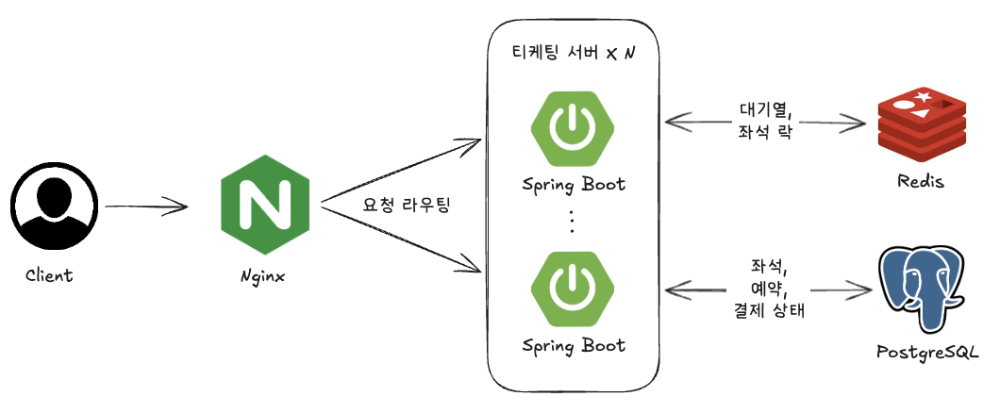

# Ticketing Concurrency Lab

부하테스트 기반 티켓팅 동시성 개선 프로젝트입니다.

티켓팅 예매 오픈 상황을 부하테스트로 재현하고, 측정 결과에 따라 좌석 예약 방식, 대기열, Redis 기반 멀티 인스턴스 구조로 고도화했습니다.

- 기간: 2026.04 ~ 2026.05
- Notion: [Ticketing Concurrency Lab](https://www.notion.so/Ticketing-Concurrency-Lab-36373344235881fdb466f9b0636095df)
- 검증 자료: [docs/evidence/README.md](docs/evidence/README.md)
- 기술 스택: Java, Spring Boot, PostgreSQL, Redis, JPA, Flyway, Testcontainers, k6, Prometheus, Grafana
- 담당 범위: 좌석 예약 방식 비교, 대기열 구현, Redis 기반 분산 구성, 결제 상태 전이, 부하테스트
- 검증 범위: 실제 PG/카드사 호출은 제외하고 Mock 결제 게이트웨이와 로컬 부하테스트 결과를 사용했습니다.

## 최종 아키텍처



```text
Client
  -> Nginx
  -> Ticketing Server x N
       -> Redis: 대기열, 좌석 락
       -> PostgreSQL: 좌석, 예약, 결제 상태
```

예매 요청은 대기열에서 순서를 받은 뒤, 대기열을 통과한 요청만 좌석 예약 API로 전달합니다. 백엔드 인스턴스를 늘리는 구간에서는 Redis가 대기열과 좌석 단위 락 상태를 공유하고, PostgreSQL이 최종 좌석 예약 정합성을 보장합니다.

## 아키텍처 설계 기준

초기 목표는 예매 오픈 상황에서 좌석 예약 정합성과 피크 요청 제어를 검증하는 것이었습니다.

- 기능 요구사항: 동일 좌석의 최종 예약은 1건만 생성되어야 하고, 예매 요청은 대기 순서에 따라 좌석 예약 API로 전달되어야 합니다.
- 비기능 요구사항: 5K RPS 피크 구간에서 실패 응답과 제한 시간 초과를 줄이고, 좌석 예약 API가 처리 가능한 범위 안에서 요청을 받도록 제어해야 합니다.
- MVP 제외 범위: 실제 PG/카드사 호출, 운영 환경 장애 전환, Redis/PostgreSQL 클러스터링과 저장소 계층 확장, 실시간 알림과 장기 모니터링은 다루지 않았습니다.

동일 좌석 경합 테스트에서는 최종 예약 1건을 유지하면서 p99와 처리량을 함께 비교했습니다. 이 결과를 기준으로 좌석 예약은 PostgreSQL의 상태 조건 기반 UPDATE와 조건부 유니크 인덱스로 처리했습니다.

5K RPS 부하에서는 좌석 예약 API가 처리 한도를 넘은 요청을 직접 받으면 실패 응답과 제한 시간 초과가 증가했습니다. 그래서 피크 요청은 대기열에서 순서를 관리하고, 대기열을 통과한 요청만 좌석 예약 API로 전달하도록 구성했습니다.

메모리 기반 대기열은 실패 요청을 줄이는 데 효과가 있었지만, 단일 인스턴스 안에서만 대기 순서와 통과 상태를 관리했습니다. 응답시간만 보면 단일 인스턴스 스펙업이 더 낮았지만, 티켓팅 서버는 오픈 직후 장애와 예측 초과 트래픽이 큰 운영 리스크로 이어집니다. 그래서 백엔드 인스턴스를 늘려도 대기열과 좌석 단위 락 상태를 공유할 수 있도록 Redis Sorted Set(ZSET) 기반 대기열과 Redis SET NX/TTL 기반 좌석 락을 적용했습니다.

대기열 디스패처는 여러 인스턴스에서 동시에 실행될 수 있으므로 ShedLock으로 중복 실행을 제한했습니다. 락 만료 이후 늦게 도착한 요청이 좌석 상태를 갱신하지 못하도록 fencing token을 PostgreSQL 갱신 조건에 반영했습니다.

## 부하테스트 및 개선 1. 좌석 예약 경합

[상세 테스트](docs/evidence/seat-reservation-contention.md)

동일 좌석에 여러 예약 요청이 동시에 들어와도 최종 예약은 1건이어야 합니다. 단순 조회 후 저장 방식에서는 여러 요청이 같은 좌석을 예약 가능 상태로 읽은 뒤 각각 저장을 시도할 수 있었습니다.

| 시나리오 | 좌석 조건 | 요청 수 | 예약 방식 | 최종 예약 | 거절 | p99 | 처리량 |
| --- | --- | ---: | --- | ---: | ---: | ---: | ---: |
| 동일 좌석 경합 | 좌석 1개 | 1,000건 | 비관적 락과 조건부 유니크 인덱스 | 1 | 999 | 586ms | 1490 ops/s |
| 동일 좌석 경합 | 좌석 1개 | 1,000건 | 상태 조건 기반 UPDATE와 조건부 유니크 인덱스 | 1 | 999 | 192ms | 4219 ops/s |
| 분산 좌석 요청 | 좌석 1,000개 | 2,000건 | 비관적 락 | 808 | 1192 | 1240ms | 1385 ops/s |
| 분산 좌석 요청 | 좌석 1,000개 | 2,000건 | 상태 조건 기반 UPDATE | 808 | 1192 | 782ms | 2250 ops/s |

좌석 예약은 상태 조건 기반 UPDATE로 예약 가능 여부를 판단하고, 예약 테이블에는 조건부 유니크 인덱스를 적용했습니다. 이 조합은 동일 좌석 경합에서 최종 예약 1건을 유지하면서 비관적 락보다 p99와 처리량이 더 좋았습니다.

## 부하테스트 및 개선 2. 예매 오픈 피크 트래픽

[상세 테스트](docs/evidence/opening-surge-queue.md)

대기열 없이 5K RPS 부하를 좌석 예약 API로 직접 보내면 애플리케이션 스레드와 DB 커넥션 사용량이 급증했습니다. 처리 한도를 넘은 요청은 실패 응답과 제한 시간 초과로 종료됐습니다.

| 구성 | 백엔드 | DB | 대기열 위치 | 부하 패턴 | 처리 지표 | 실패/대기 지표 |
| --- | --- | --- | --- | --- | --- | --- |
| 대기열 미적용 | 4 CPU | 4 CPU | 없음 | 100-5000 RPS | 좌석 예약 성공=49,492건 | 실패 요청=181,366건, reserve p95=2.61초 |
| 메모리 대기열 적용 | 4 CPU | 4 CPU | 인스턴스 메모리 | 100-5000 RPS | 토큰 발급=119,683건, 대기열 통과=119,683건, 좌석 예약 성공=45,488건 | 대기 중 제한 시간 초과=0건, 대기 시간 p95=4.37초, 전체 p95=7.31초 |

대기열 미적용 부하에서는 처리 가능한 요청을 넘어선 구간에서 실패 응답과 제한 시간 초과가 발생했습니다. 메모리 기반 대기열 적용 후에는 같은 4 CPU 조건에서 대기 중 제한 시간 초과가 0건으로 유지됐습니다.

## 부하테스트 및 개선 3. Redis 기반 멀티 인스턴스 확장

[상세 테스트](docs/evidence/redis-multi-instance.md)

메모리 기반 대기열은 단일 인스턴스 내부 상태라 백엔드를 늘리면 서버별 대기 순서가 달라집니다. 대기열 통과 처리는 여러 인스턴스에서 동시에 실행되므로, 하나의 대기열 항목은 한 번만 통과 처리되어야 했습니다.

Redis 대기열을 적용한 뒤, 오픈 직후 요청이 몰리는 600 → 800 → 1000 → 1200 RPS 부하에서 백엔드 구성과 HikariCP pool 조건을 비교했습니다.

| 백엔드 구성 | HikariCP pool | 토큰 / 통과 / 예약 성공 | 토큰 발급 실패 | Hikari pending max | PostgreSQL conn max | 전체 p95 |
| --- | ---: | ---: | ---: | --- | ---: | ---: |
| 1대 x 2 CPU | 10 | 66,467 / 65,085 / 49,349 | 12,490 | app1 186 | 12 | 9.63초 |
| 1대 x 4 CPU | 20 | 82,487 / 82,487 / 50,000 | 0 | app1 30 | 22 | 0.49초 |
| 2대 x 2 CPU | 10 x 2 | 79,441 / 79,441 / 50,000 | 1,394 | app1 138, app2 180 | 22 | 4.90초 |

성능 수치만 보면 단일 인스턴스 스펙업이 유리했습니다. 그럼에도 티켓팅 서버는 예매 오픈 직후 장애가 곧바로 운영 리스크로 이어집니다. 예상 트래픽을 산정할 수 있어도 실제 오픈 시점에는 홍보, 팬덤 유입, 봇 요청, 재시도 요청으로 트래픽이 더 크게 몰릴 수 있습니다. 따라서 장애 영향 범위를 줄이고, 여러 백엔드 인스턴스가 대기열과 좌석 락 상태를 공유할 수 있도록 멀티 인스턴스 구조를 선택했습니다.

## 구현 모듈

| 모듈 | 역할 | 주요 확인 내용 |
| --- | --- | --- |
| [`basic/`](basic/) | 기본 예약 흐름 | 단순 조회 후 저장 방식에서 좌석 중복 예약 재현 |
| [`concurrency/`](concurrency/) | 좌석 예약 정합성 | 상태 조건 기반 UPDATE, 조건부 유니크 인덱스, 결제 멱등성 |
| [`queue/`](queue/) | 메모리 기반 대기열 | 대기열 미적용/적용 비교, 대기 중 제한 시간 초과 확인 |
| [`distributed/`](distributed/) | Redis 기반 분산 구성 | Redis ZSET 대기열, SET NX/TTL 좌석 락, ShedLock, fencing token |

## 실행

```bash
# 특정 모듈 테스트
./gradlew :concurrency:test
./gradlew :queue:test
./gradlew :distributed:test

# 특정 모듈 실행
./gradlew :queue:bootRun
./gradlew :distributed:bootRun
```

각 모듈은 독립 docker-compose와 독립 PostgreSQL 포트를 사용합니다.

## 관련 근거

- [docs/evidence/README.md](docs/evidence/README.md)
- [ticketing-observability](https://github.com/dongwooooooo/ticketing-observability)
- [seat-lock-alternatives](https://github.com/dongwooooooo/seat-lock-alternatives)
- [queue-alternatives](https://github.com/dongwooooooo/queue-alternatives)
