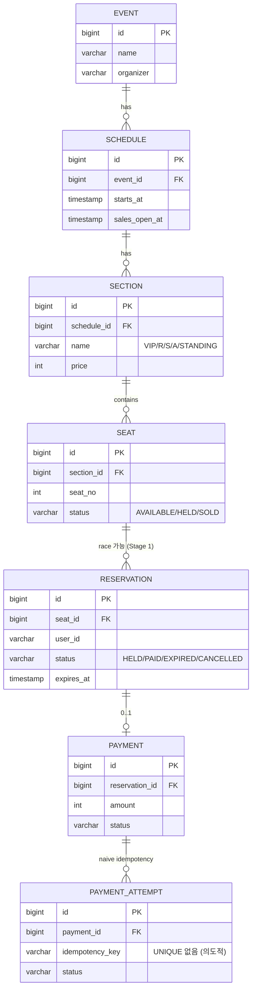
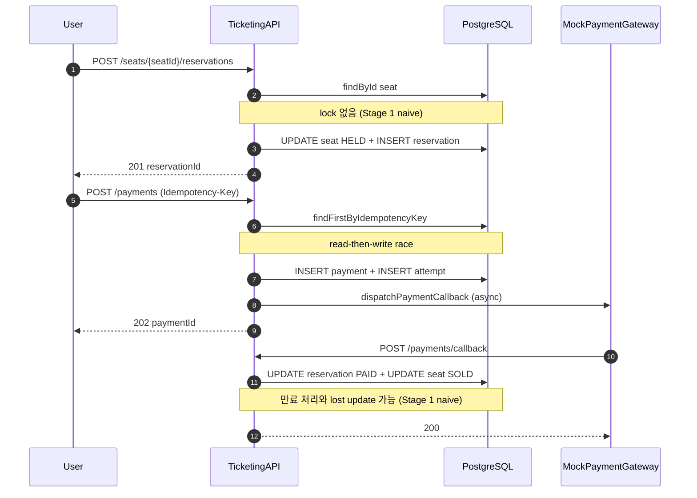
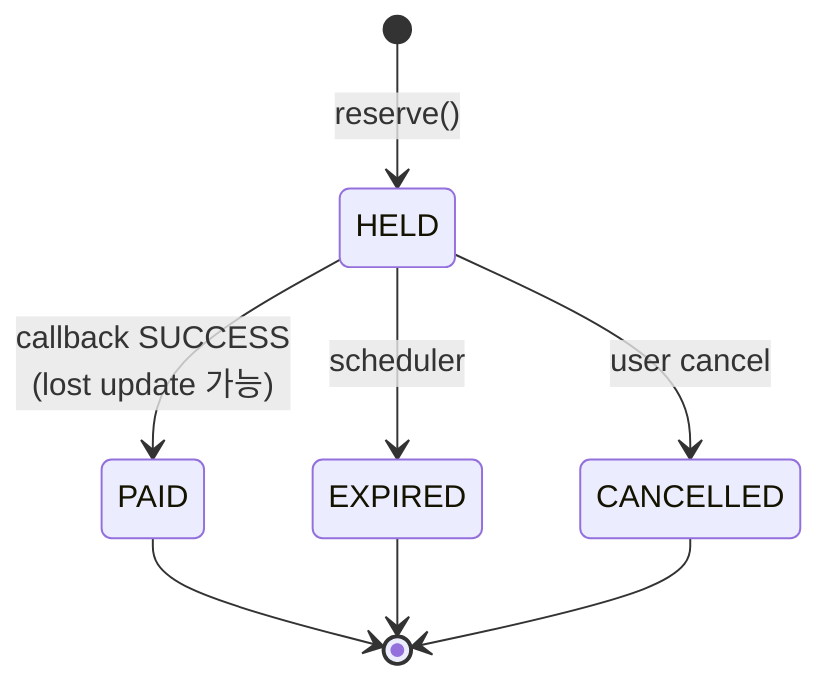

# Domain — Stage 1 (basic)

## ERD

Stage 1 의도적 누락:
- `seat_id`에 대한 partial UNIQUE 없음 → 같은 좌석 동시 INSERT 시 다중 HELD 가능 (I-001)
- `idempotency_key` UNIQUE 없음 → 같은 key 다중 INSERT 가능 (I-002)

## 플로우 — 예매 → 결제 → callback

## Reservation 상태 전이

Stage 1은 status 변경에 atomic UPDATE 없음. 동시 진입 시 비결정적 결과 (I-003).
