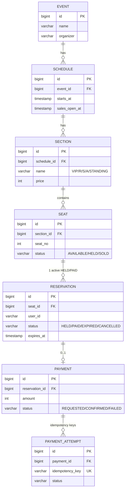
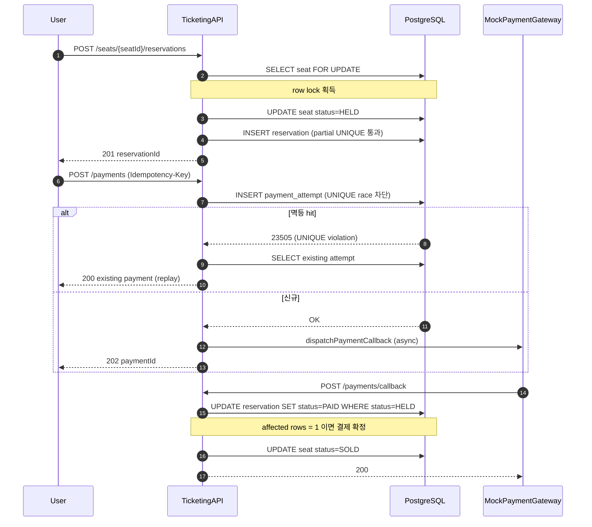
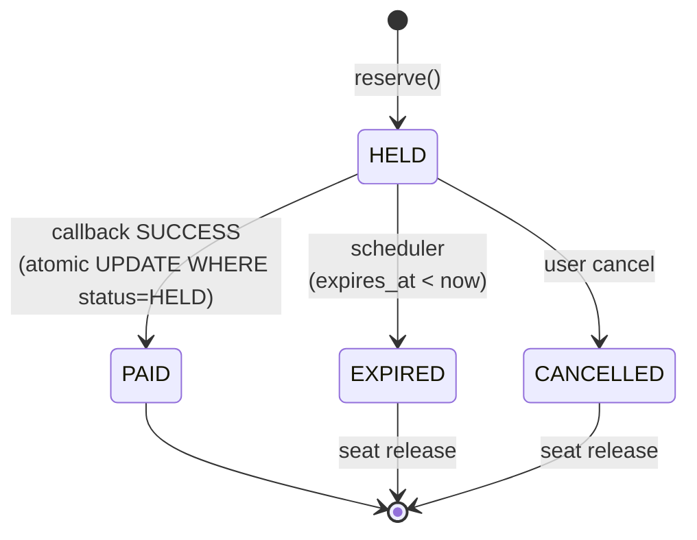
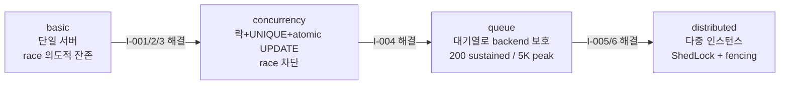

# Domain — ERD + 핵심 플로우

## ERD

좌석당 활성 reservation 1건은 partial UNIQUE index (`WHERE status IN ('HELD','PAID')`)로 보장.
idempotency_key는 UNIQUE constraint로 멱등 race 차단.

## 핵심 플로우 — 예매 → 결제 → callback

## Reservation 상태 전이

만료-callback race 시 둘 중 1건만 `affected rows == 1`. 다른 트랜잭션은 no-op (callback 측 affected=0이면 환불 큐).

## 4-stage 진화

각 stage 책임 매트릭스:

| 이슈 | basic | concurrency | queue | distributed |
|---|---|---|---|---|
| I-001 좌석 oversell | (방치) | ✅ Pessimistic+UNIQUE | – | – |
| I-002 멱등성 | (방치) | ✅ UNIQUE+catch | – | – |
| I-003 만료-callback race | (방치) | ✅ atomic UPDATE | – | – |
| I-004 트래픽 backend 직격 | (방치) | (방치) | ✅ 대기열 | – |
| I-005 스케줄러 다중 실행 | (방치) | (방치) | (방치) | ✅ ShedLock |
| I-006 분산 좌석 락 | (방치) | (방치) | (방치) | ✅ Redis + fencing |
