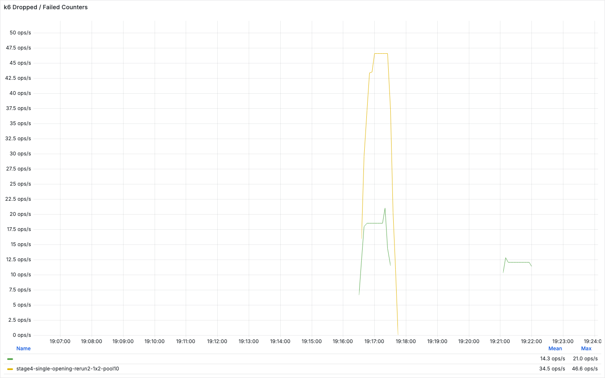
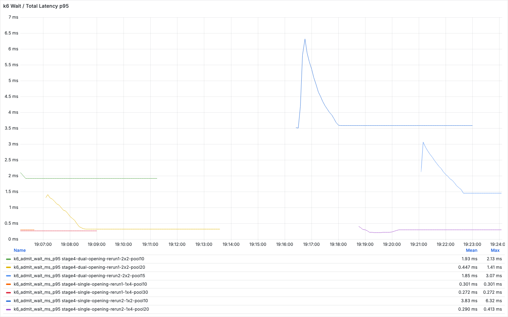

# 예매 오픈 피크 트래픽 k6 테스트

예매 오픈 직후 5K RPS 부하에서 좌석 예약 API 직접 처리와 메모리 기반 대기열 적용 결과를 비교한 테스트다.

## 시나리오

- 부하 패턴은 `100 -> 500 -> 1000 -> 2000 -> 3500 -> 5000 RPS`로 올린다.
- 대기열 미적용 구성은 좌석 예약 API를 바로 호출한다.
- 메모리 대기열 구성은 토큰 발급, 대기 상태 조회, 좌석 예약 순서로 호출한다.
- 좌석 수는 50,000개로 둔다.

## 실행 조건

| 항목 | 대기열 미적용 | 메모리 대기열 적용 |
| --- | --- | --- |
| 모듈 | `concurrency` | `queue` |
| 백엔드 / DB | 4 CPU / 4 CPU | 4 CPU / 4 CPU |
| 원본 summary | [`stage2-a4-summary.json`](../results/raw/stage2-a4-summary.json) | [`stage3-a4-summary.json`](../results/raw/stage3-a4-summary.json) |

## 측정 결과

| 구성 | 요청/토큰 | 좌석 예약 성공 | 실패 요청 | 대기 중 타임아웃 | 대기 시간 p95 |
| --- | ---: | ---: | ---: | ---: | ---: |
| 대기열 미적용 | 좌석 예약 요청 `204,043건` | `49,194건` | `154,849건` | 해당 없음 | 해당 없음 |
| 메모리 대기열 적용 | 토큰 발급 `106,683건` | `44,178건` | 좌석 매진 이후 거절 `62,505건` | `0건` | `3.6초` |

## Grafana 결과 해석

대기열 미적용 구성에서는 처리 한도를 넘은 요청이 실패 응답으로 끝났다. 메모리 대기열 적용 후에는 같은 부하 패턴에서 대기 중 타임아웃이 0건으로 유지됐다.

대기열의 목적은 처리량 증가보다 초과 요청을 바로 실패시키지 않고 순서에 따라 좌석 예약 API로 넘기는 데 있다. 대기 시간 p95는 3.6초로 측정됐고, 이 값은 사용자가 기다리는 비용으로 함께 확인해야 한다.

## 결과 해석

좌석 예약 API 직접 처리에서는 피크 구간의 초과 요청이 실패 응답으로 종료됐다. 메모리 대기열은 실패 응답을 대기 상태로 전환하는 효과를 확인하기 위한 첫 단계로 사용했다.
