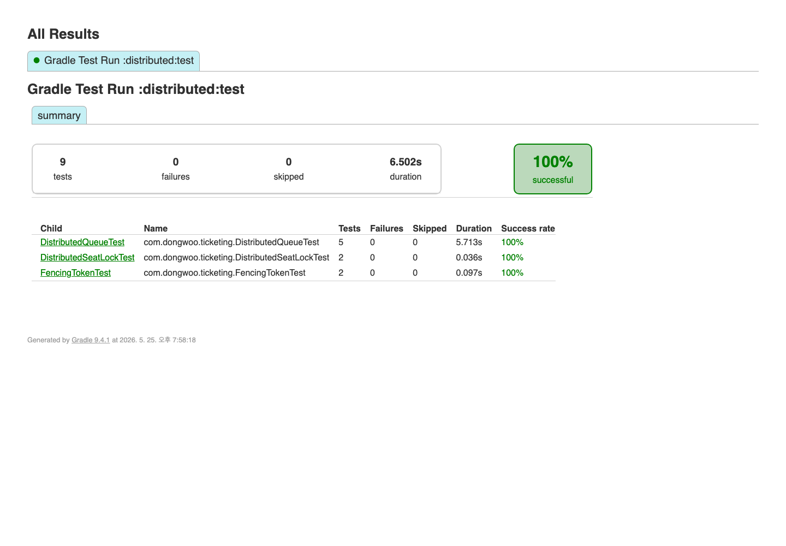

# Redis 분산 상태 단위 테스트

Redis 기반 대기열과 좌석 락이 여러 백엔드 인스턴스에서 같은 상태를 기준으로 동작하는지 확인한 테스트다.

## 시나리오

- 한 인스턴스에서 발급한 토큰을 다른 인스턴스에서 조회한다.
- 두 인스턴스가 동시에 대기열 통과 처리를 실행해도 같은 항목이 중복 통과되지 않아야 한다.
- 같은 좌석에 대한 Redis 락 획득은 1건만 성공해야 한다.
- 이전 락 보유자의 늦은 갱신은 fencing token으로 차단되어야 한다.

## 테스트 코드

| 항목 | 경로 |
| --- | --- |
| Redis 대기열 테스트 | [`DistributedQueueTest.java`](../../../distributed/src/test/java/com/dongwoo/ticketing/DistributedQueueTest.java) |
| Redis 좌석 락 테스트 | [`DistributedSeatLockTest.java`](../../../distributed/src/test/java/com/dongwoo/ticketing/DistributedSeatLockTest.java) |
| Fencing token 테스트 | [`FencingTokenTest.java`](../../../distributed/src/test/java/com/dongwoo/ticketing/FencingTokenTest.java) |
| Redis 대기열 구현 | [`RedisWaitingQueue.java`](../../../distributed/src/main/java/com/dongwoo/ticketing/queue/RedisWaitingQueue.java) |
| Redis 좌석 락 구현 | [`DistributedSeatLock.java`](../../../distributed/src/main/java/com/dongwoo/ticketing/lock/DistributedSeatLock.java) |

## 실행 명령

```bash
./gradlew :distributed:test --tests '*DistributedQueueTest'
./gradlew :distributed:test --tests '*DistributedSeatLockTest'
./gradlew :distributed:test --tests '*FencingTokenTest'
```

## 실행 결과

| 테스트 | 결과 |
| --- | --- |
| 인스턴스 간 토큰 조회 | 다른 인스턴스에서 조회 가능 |
| 중복 통과 방지 | 총 통과 100건, 중복 0건 |
| 대기 순서 유지 | 30건 등록 후 10건 통과, 대기 20건 |
| 좌석 락 경합 | 100개 스레드 중 1건 획득, 99건 거절 |
| fencing token | 이전 보유자 갱신 0건, 새 보유자 갱신 1건 |



## 결과 해석

단위 테스트는 Redis를 대기열 상태와 좌석 단위 락 상태를 공유하는 저장소로 사용했을 때 필요한 정합성 조건을 확인한다. 최종 중복 예약 차단은 PostgreSQL 제약을 함께 사용한다.
