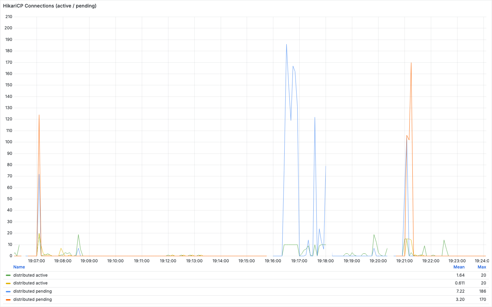
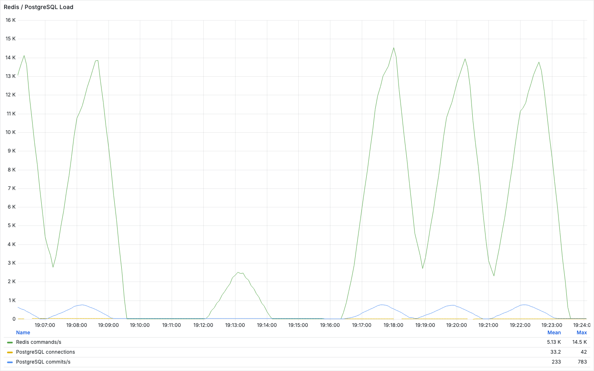

# Redis 멀티 인스턴스 k6 테스트

Redis 기반 대기열을 둔 상태에서 단일 인스턴스 스펙업과 백엔드 2대 구성을 비교한 테스트다.

## 시나리오

- 부하 패턴은 `600 -> 800 -> 1000 -> 1200 RPS`로 올린다.
- Redis는 대기열과 좌석 락 상태를 공유한다.
- PostgreSQL은 좌석, 예약, 결제 상태를 저장한다.
- 단일 인스턴스 스펙업과 2대 구성을 같은 부하 패턴에서 비교한다.

## 측정 결과

| 백엔드 구성 | HikariCP pool | 토큰 / 통과 / 예약 성공 | 토큰 발급 실패 | Hikari pending max | DB connection max | 전체 p95 |
| --- | ---: | ---: | ---: | --- | ---: | ---: |
| 1대 x 2 CPU | 10 | 78,407 / 78,375 / 50,000 | 2,551 | app1 186 | 13 | 5.16초 |
| 1대 x 4 CPU | 20 | 82,488 / 82,488 / 50,000 | 0 | app1 7 | 22 | 0.51초 |
| 2대 x 2 CPU | 10 x 2 | 81,394 / 81,394 / 50,000 | 88 | app1 170, app2 54 | 23 | 3.17초 |
| 2대 x 2 CPU | 20 x 2 | 82,445 / 82,445 / 50,000 | 0 | app1 72, app2 124 | 42 | 0.66초 |

원본 summary:

- [`stage4-single-1x2-pool10-summary.json`](../results/raw/stage4-single-1x2-pool10-summary.json)
- [`stage4-single-1x4-pool20-summary.json`](../results/raw/stage4-single-1x4-pool20-summary.json)
- [`stage4-dual-2x2-pool10-summary.json`](../results/raw/stage4-dual-2x2-pool10-summary.json)
- [`stage4-dual-2x2-pool20-summary.json`](../results/raw/stage4-dual-2x2-pool20-summary.json)
- [`stage4-prometheus-evidence.json`](../results/raw/stage4-prometheus-evidence.json)

## Grafana 결과 해석

HikariCP pool 10 조건에서는 pending이 크게 증가했다. pool 20 조건에서는 토큰 발급 실패가 0건으로 줄었고 전체 p95도 낮아졌다. 이 결과는 백엔드 인스턴스 수만 비교하면 부족하고, DB connection 설정을 함께 확인해야 한다는 근거로 사용했다.

Redis ops는 약 14k/s 수준까지 올라갔고, DB connection은 2대 x 2 CPU / pool 20 조건에서 42까지 증가했다. 서버를 늘리면 Redis 요청량과 DB connection도 함께 증가하므로 저장소 계층의 확장 비용을 별도로 봐야 한다.

## 결과 해석

응답시간만 보면 1대 x 4 CPU / pool 20 구성이 가장 낮았다. 멀티 인스턴스 구조는 로컬 환경에서 단일 스펙업보다 빠르다는 근거로 사용하지 않았다. 핵심은 예매 오픈 직후 장애 영향 범위와 예측 초과 트래픽 대응을 위해 대기열과 좌석 락 상태를 인스턴스 밖에서 공유하는 구조를 검증한 데 있다.
