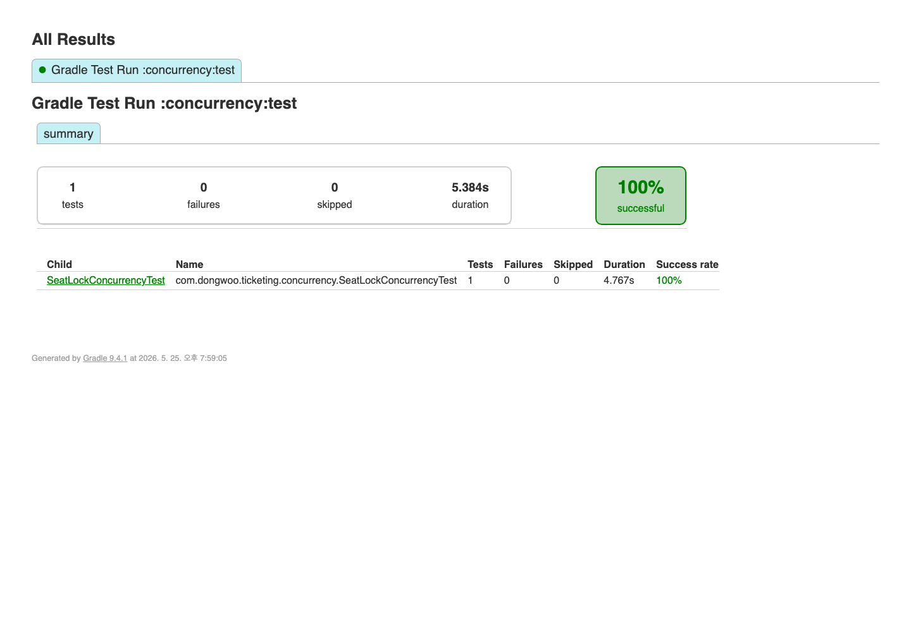

# 좌석 예약 경합 테스트

동일 좌석에 여러 예약 요청이 동시에 들어와도 최종 예약이 1건만 생성되는지 확인한 테스트다.

## 시나리오

- 좌석 1개에 100개 요청을 동시에 보낸다.
- 예약 성공은 1건이어야 한다.
- 나머지 요청은 거절되어야 한다.
- DB에 남은 최종 예약도 1건이어야 한다.

## 테스트 코드

| 항목 | 경로 |
| --- | --- |
| 테스트 | [`SeatLockConcurrencyTest.java`](../../../concurrency/src/test/java/com/dongwoo/ticketing/concurrency/SeatLockConcurrencyTest.java) |
| 예약 서비스 | [`ReservationService.java`](../../../concurrency/src/main/java/com/dongwoo/ticketing/service/ReservationService.java) |
| DB 제약 | [`V3__concurrency_constraints.sql`](../../../concurrency/src/main/resources/db/migration/V3__concurrency_constraints.sql) |

## 실행 명령

```bash
./gradlew :concurrency:test --tests '*SeatLockConcurrencyTest'
```

## 실행 결과

| 입력 조건 | 성공 | 거절 | 최종 예약 |
| --- | ---: | ---: | ---: |
| 동일 좌석 1개, 동시 요청 100건 | 1 | 99 | 1 |

```text
seatReservationRace total=100 success=1 rejected=99 heldCount=1
```



## 결과 해석

테스트 결과는 동일 좌석 경합에서 최종 예약 1건이 유지되는지를 확인한다. 성능 비교에서는 같은 정합성 조건을 유지한 상태에서 비관적 락과 상태 조건 기반 UPDATE의 p99와 처리량을 비교했다.
